# Map of the library
> Generated by `python tools/catalog.py`. Arrows point from a paper to the papers that build on it.

```mermaid
flowchart LR
  subgraph p_datasets_computational_pathology["Datasets · computational pathology"]
    p_sirinukunwattana2017glas["GlaS<br/>2017"]
    p_graham2019mildnet["MILD-Net / CRAG<br/>2019"]
    p_gamper2020pannuke["PanNuke<br/>2020"]
    p_graham2021lizard["Lizard<br/>2021"]
  end
  subgraph p_privacy_differential_privacy["Differential privacy"]
    p_dwork2006calibrating["Laplace mechanism / ε-DP<br/>2006"]
  end
  subgraph p_reinforcement_learning_policy_optimization["RL · policy optimization (PPO → GRPO → R1 → DAPO)"]
    p_schulman2017ppo["PPO<br/>2017"]
    p_shao2024deepseekmath["GRPO / DeepSeekMath<br/>2024"]
    p_guo2025deepseekr1["DeepSeek-R1 / R1-Zero<br/>2025"]
    p_yu2025dapo["DAPO<br/>2025"]
  end
  subgraph p_reinforcement_learning_rl_for_medical_vqa["RL · medical visual question answering"]
    p_lai2025medr1["Med-R1<br/>2025"]
  end
  subgraph p_reinforcement_learning_rl_for_pathology["RL · agents for pathology"]
    p_qaiser2019where["Learning Where to See<br/>2019"]
    p_hilt2021rlinstance["Stateless actor-critic instance segmentation (RL with priors)<br/>2021"]
    p_zhao2023rlogist["RLogist<br/>2023"]
    p_nan2025pean["PEAN<br/>2025"]
  end
  subgraph p_reinforcement_learning_rl_for_segmentation["RL · reasoning segmentation & grounding"]
    p_liu2025segzero["Seg-Zero<br/>2025"]
    p_you2025segr1["Seg-R1<br/>2025"]
    p_zhu2025lens["LENS<br/>2025"]
    p_huang2025samr1["SAM-R1<br/>2025"]
    p_xu2025medground["MedGround-R1<br/>2025"]
    p_yan2025medreasoner["MedReasoner / U-MRG-14K<br/>2025"]
    p_liu2026medsamagent["MedSAM-Agent<br/>2026"]
  end
  subgraph p_segmentation_architectures["Segmentation · architectures & task definitions"]
    p_ronneberger2015unet["U-Net<br/>2015"]
    p_kirillov2019panoptic["Panoptic Segmentation / PQ<br/>2019"]
    p_isensee2021nnunet["nnU-Net<br/>2021"]
  end
  subgraph p_segmentation_nuclei_instance["Segmentation · nuclei, cell & gland instances"]
    p_chen2016dcan["DCAN<br/>2016"]
    p_schmidt2018stardist["StarDist<br/>2018"]
    p_graham2019hovernet["HoVer-Net<br/>2019"]
    p_qu2020weaknuclei["Partial-points nuclei segmentation (Qu et al.)<br/>2020"]
    p_stringer2021cellpose["Cellpose<br/>2021"]
    p_lin2023scnet["SC-Net<br/>2023"]
  end
  subgraph p_segmentation_promptable_foundation_models["Segmentation · promptable foundation models"]
    p_kirillov2023sam["SAM<br/>2023"]
    p_ravi2024sam2["SAM 2<br/>2024"]
  end
  subgraph p_segmentation_topology_aware["Segmentation · topology-aware losses"]
    p_hu2019topoloss["TopoLoss (Hu et al.)<br/>2019"]
    p_clough2019topological["Topological prior loss (Clough et al.)<br/>2019"]
    p_shit2021cldice["clDice<br/>2021"]
    p_stucki2023barcodes["Betti Matching<br/>2023"]
    p_berger2024topo["Multi-class Betti Matching<br/>2024"]
  end
  p_schulman2017ppo --> p_shao2024deepseekmath
  p_shao2024deepseekmath --> p_guo2025deepseekr1
  p_schulman2017ppo --> p_yu2025dapo
  p_shao2024deepseekmath --> p_yu2025dapo
  p_guo2025deepseekr1 --> p_yu2025dapo
  p_shao2024deepseekmath --> p_liu2025segzero
  p_guo2025deepseekr1 --> p_liu2025segzero
  p_ravi2024sam2 --> p_liu2025segzero
  p_shao2024deepseekmath --> p_you2025segr1
  p_ravi2024sam2 --> p_you2025segr1
  p_shao2024deepseekmath --> p_zhu2025lens
  p_liu2025segzero --> p_zhu2025lens
  p_ravi2024sam2 --> p_zhu2025lens
  p_shao2024deepseekmath --> p_huang2025samr1
  p_guo2025deepseekr1 --> p_huang2025samr1
  p_yu2025dapo --> p_huang2025samr1
  p_liu2025segzero --> p_huang2025samr1
  p_ravi2024sam2 --> p_huang2025samr1
  p_shao2024deepseekmath --> p_xu2025medground
  p_guo2025deepseekr1 --> p_xu2025medground
  p_shao2024deepseekmath --> p_liu2026medsamagent
  p_ravi2024sam2 --> p_liu2026medsamagent
  p_you2025segr1 --> p_liu2026medsamagent
  p_liu2025segzero --> p_liu2026medsamagent
  p_huang2025samr1 --> p_liu2026medsamagent
  p_shao2024deepseekmath --> p_lai2025medr1
  p_guo2025deepseekr1 --> p_lai2025medr1
  p_ronneberger2015unet --> p_isensee2021nnunet
  p_kirillov2023sam --> p_ravi2024sam2
  p_kirillov2019panoptic --> p_graham2019hovernet
  p_ronneberger2015unet --> p_schmidt2018stardist
  p_ronneberger2015unet --> p_stringer2021cellpose
  p_sirinukunwattana2017glas --> p_chen2016dcan
  p_qu2020weaknuclei --> p_lin2023scnet
  p_ronneberger2015unet --> p_lin2023scnet
  p_ronneberger2015unet --> p_qu2020weaknuclei
  p_ronneberger2015unet --> p_hu2019topoloss
  p_ronneberger2015unet --> p_clough2019topological
  p_ronneberger2015unet --> p_shit2021cldice
  p_hu2019topoloss --> p_stucki2023barcodes
  p_stucki2023barcodes --> p_berger2024topo
  p_ronneberger2015unet --> p_berger2024topo
  p_schulman2017ppo --> p_zhao2023rlogist
  p_qaiser2019where --> p_zhao2023rlogist
  p_zhao2023rlogist --> p_nan2025pean
  p_ronneberger2015unet --> p_hilt2021rlinstance
  p_graham2019hovernet --> p_gamper2020pannuke
  p_kirillov2019panoptic --> p_gamper2020pannuke
  p_chen2016dcan --> p_graham2019mildnet
  p_sirinukunwattana2017glas --> p_graham2019mildnet
  p_graham2019hovernet --> p_graham2021lizard
  p_gamper2020pannuke --> p_graham2021lizard
  p_sirinukunwattana2017glas --> p_graham2021lizard
  p_graham2019mildnet --> p_graham2021lizard
  p_kirillov2019panoptic --> p_graham2021lizard
  p_shao2024deepseekmath --> p_yan2025medreasoner
  p_liu2025segzero --> p_yan2025medreasoner
```

## Reading paths

### Policy optimization for reasoning LLMs: PPO to GRPO to R1 to DAPO
Every RL paper on segmentation, medical imaging and pathology in this library reuses this objective and its rewards. Reading them in historical order shows why each change was made: the clipped ratio first, then removing the critic, then rewards from simple rules, then fixes for training at scale. Each later vision paper then reads as a small change to a known recipe.

1. **PPO** — Learn the clipped probability-ratio objective, how advantages are estimated with a learned value function (the critic, via GAE), and why several epochs on each batch are safe. Every later paper modifies this objective.
2. **GRPO / DeepSeekMath** — GRPO: sample a group of answers per prompt and use each reward minus the group mean, divided by the group's standard deviation, as the advantage, so no critic is needed. The KL penalty to a reference model moves into the loss. Also note that the math pretraining corpus is half of the paper's result.
3. **DeepSeek-R1 / R1-Zero** — R1-Zero: GRPO with only answer-accuracy and format rewards produces long chains of thought and self-checking. R1 adds a cold-start SFT stage and distillation. The <think>/<answer> template and rule-based rewards introduced here are what the vision papers copy.
4. **DAPO** — DAPO's four fixes for training at scale: Clip-Higher (separate lower and upper clip ranges, to stop entropy collapse), dynamic sampling (drop prompt groups that are all right or all wrong), per-token loss averaging, and a soft penalty for over-long answers. Remember Clip-Higher, because SAM-R1 borrows it.

### From Segment Anything to reasoning segmentation
Read 'rl-foundations' first. This path starts with the frozen tool (SAM/SAM 2) and then compares four ways of connecting a reasoning VLM to it. The open design question it frames is whether to keep the segmenter frozen behind a text interface or to train everything end to end.

1. **SAM** — SAM's split into a prompt encoder, a heavy image encoder and a light mask decoder, plus its multiple candidate masks for ambiguous prompts. Understand why one box and a couple of points are enough to get a good mask, since that is the interface every RL-segmentation paper uses.
2. **SAM 2** — SAM 2 adds a streaming memory for video and is also better and faster on still images. It is the frozen mask generator used by Seg-Zero, Seg-R1, SAM-R1 and LENS.
3. **Seg-Zero** — Seg-Zero, the template: a reasoning VLM (Qwen2.5-VL) writes a box and points as text, and a frozen SAM2 produces the mask. GRPO is trained with format, box and point rewards and no reasoning annotations, and it generalizes zero-shot to ReasonSeg better than SFT does.
4. **Seg-R1** — Seg-R1 is the simplest version: the reward is the quality of SAM2's mask itself. It trains on plain foreground tasks (camouflaged and salient object detection) and still transfers zero-shot to referring and reasoning segmentation. It also gives a clear comparison of RL against SFT.
5. **SAM-R1** — SAM-R1 puts SAM inside the RL loop as the reward provider (IoU of the mask produced from the predicted prompt), adds finer-grained rewards and borrows DAPO's asymmetric clipping. It gets strong results from only about 3k samples.
6. **LENS** — LENS drops the text-box bottleneck: learned context embeddings from the VLM feed straight into SAM2, and both are trained together with RL using format, box and mask rewards. Weigh the richer interface against losing the plug-in, frozen-tool simplicity.

### RL-trained medical vision-language models: answer, box, mask, agent
Read 'rl-foundations' and 'reasoning-segmentation' first. The four medical papers ask for more spatial precision and more interaction at each step: a text answer, then a box, then a pixel mask through a medical SAM, then a multi-turn annotating agent. Reading them in this order shows how the R1 recipe was adapted to clinical data one step at a time.

1. **Med-R1** — Med-R1: GRPO with accuracy and format rewards on medical VQA across 8 imaging types. RL generalizes across imaging types and question types better than SFT, and a 2B model beats a 72B one. It shows the R1 recipe carries over to medicine.
2. **MedGround-R1** — MedGround-R1 grounds a text phrase to a box on chest X-rays. Its rewards combine spatial overlap with semantic match (MedCLIP), and it uses chain-of-box reasoning without hand-written reasoning examples. This is the first move from answers to locations.
3. **MedReasoner / U-MRG-14K** — MedReasoner answers vague clinical questions. A reasoning module outputs a box plus two points, a frozen MedSAM2 produces the mask, and the paper releases the U-MRG-14K dataset. It is effectively Seg-Zero redesigned for clinical language.
4. **MedSAM-Agent** — MedSAM-Agent works over multiple turns, choosing box, point and stop actions. It is trained first by SFT on simulated expert sessions and then by GRPO with process rewards for improvement, overshoot and number of actions. It is explicitly positioned against single-turn, final-outcome-reward methods (Seg-Zero, Seg-R1, SAM-R1).

### Biomedical segmentation: U-Net to nuclei instances and their benchmarks
Covers the supervised side of the library: the network everyone builds on, the metric everyone reports, the two main ways of separating touching nuclei, the datasets that made the field measurable, and how point clicks replace full outlines. It is a prerequisite for 'topology-aware' and useful context for 'rl-in-pathology'. The intended Cellpose (18) and DCAN (20) PDFs are wrong downloads; get the correct ones to fill gaps after HoVer-Net and GlaS.

1. **U-Net** — Encoder-decoder with skip connections, a weighted loss that separates touching cells, and heavy elastic augmentation. Nearly every later method in this path uses it as the backbone.
2. **nnU-Net** — How the whole pipeline is configured (dataset fingerprint, rule-based and empirical settings) matters more than changes to the architecture. nnU-Net is the strong baseline any medical segmentation claim has to beat.
3. **Panoptic Segmentation / PQ** — Panoptic segmentation and PQ = SQ x RQ, with predicted and true segments matched at IoU > 0.5. You need this to read the metrics in every nuclei paper and dataset paper below.
4. **GlaS** — GlaS, an early pathology challenge on segmenting individual glands. Learn its object-level F1, object Dice and object Hausdorff distance, and how it scores benign and malignant tissue separately.
5. **DCAN** — The GlaS winner: predict objects and contours jointly, subtract contours to split touching glands, an idea HoVer-Net and others refine.
6. **MILD-Net / CRAG** — Keeps fine detail by re-injecting the image; introduces the CRAG dataset used by Lizard.
7. **StarDist** — StarDist: each pixel predicts a star-convex polygon (radial distances along 32 rays), followed by non-maximum suppression. A built-in shape prior solves crowding in fluorescence microscopy.
8. **HoVer-Net** — HoVer-Net: horizontal and vertical distance-to-centre maps, separating nuclei where those maps jump sharply, and a branch that classifies cell type. It brings PQ to nuclei and introduces the CoNSeP dataset. Compare its representation with StarDist's.
9. **PanNuke** — PanNuke: 19 tissue types, 5 cell classes and semi-automatic annotation checked by pathologists. It is the standard pan-cancer benchmark for multi-class nuclei, evaluated with PQ.
10. **Lizard** — Lizard: about 495k colon nuclei in 6 classes. A HoVer-Net-style model does most of the drawing and pathologists only fix its mistakes, which shows how datasets grew by orders of magnitude.
11. **Partial-points nuclei segmentation (Qu et al.)** — Qu et al.: detect all centres from about 10% clicked points, build Voronoi and k-means cluster pseudo-labels, refine with a CRF, and self-train. This is the base recipe for learning from points.
12. **SC-Net** — SC-Net: Voronoi and cluster labels from points, two networks that co-train each other, and a self-supervised task that recolours the hematoxylin channel back into the full H&E image. A recent example of how weakly supervised nuclei segmentation is designed.

### Topology-aware segmentation losses
Read U-Net (12) first. Overlap losses like Dice cannot see a broken vessel or a missing hole. This path goes from the basic tool (persistent homology with a known shape prior) to a cheap skeleton-based alternative, then to spatially correct matching of topological features, then to many classes. The foundational Hu et al. 2019 TopoLoss (slot 24) is a wrong PDF; re-download arXiv 1906.05404 and read it between 26 and 27.

1. **TopoLoss (Hu et al.)** — The starting point: a persistent-homology loss that makes predicted masks have the right number of components and holes. Everything after refines or replaces it.
2. **Topological prior loss (Clough et al.)** — Persistent homology and Betti numbers in practice. A known shape (for example 'a ring: one piece, one hole') is enforced through a differentiable loss without needing the ground truth, which allows semi-supervised training on cardiac MRI.
3. **clDice** — clDice: a soft skeleton and the overlap between each mask's centreline and the other mask, with topology guarantees for thin tubular structures. It is a far cheaper alternative to persistent homology, and the baseline later papers compare against.
4. **Betti Matching** — Betti matching: induced matchings of persistence barcodes pair each topological feature with the spatially corresponding one in the ground truth, which fixes the wrong pairings of Hu et al.'s Wasserstein loss. It gives both a metric and a loss.
5. **Multi-class Betti Matching** — The multi-class extension treats each class as a binary map (plus union and background terms) and adds weighting by structure. It also builds multi-class versions of the clDice and HuTopo losses as baselines, so it doubles as a comparison of the whole path.

### RL agents for pathology and microscopy
Read PPO (01) first. These papers use RL for a different reason than the LLM papers: slides are too large to process everywhere, and the useful signals (where an expert looks, rules about what a nucleus looks like) cannot be differentiated. Reading in this order goes from glimpse attention to full-slide scanning paths to learning from pathologists' gaze, and ends with RL rewarding a segmentation through non-differentiable rules, the same idea that SAM-R1 applies with SAM-based rewards.

1. **Learning Where to See** — A recurrent attention agent trained by policy gradient that looks at an overview, then takes a few glimpses, with inhibition of return so it doesn't revisit spots, before giving a HER2 score. This is the 'learn where to look' formulation.
2. **RLogist** — RLogist: a PPO agent scans at low magnification and builds a short observation path over the whole slide, using feature super-resolution and multiple-instance-learning classification. It extends Qaiser's glimpse idea from cropped regions to entire slides, for speed.
3. **PEAN** — PEAN turns pathologists' eye-tracking data into per-patch expertise values, which drive slide classification and a Q-learning agent that imitates how pathologists review slides. Contrast learning from human gaze with learning from a task reward (RLogist).
4. **Stateless actor-critic instance segmentation (RL with priors)** — Stateless soft actor-critic on superpixel-graph edges, rewarded by high-level rules (object size, shape, roundness) that need not be differentiable. A conceptual bridge from pathology RL to the reward-driven segmentation of SAM-R1 and Seg-R1.

## Multi-paper video ideas

- **Dropping the critic: PPO, GRPO, R1-Zero and DAPO** (PPO, GRPO / DeepSeekMath, DeepSeek-R1 / R1-Zero, DAPO) — Open with the problem PPO solves: a policy update that is too large wrecks the policy, so PPO clips the probability ratio and relies on a critic network to estimate advantages. Move to LLMs, where a critic as large as the policy is expensive. DeepSeekMath's GRPO samples a group of answers per question and scores each one against the group average, so the critic disappears. DeepSeek-R1-Zero then shows that GRPO with only rule-checked correctness and format rewards produces long reasoning and 'aha' self-correction. Close with DAPO as the honest account of what breaks at scale (entropy collapse, groups that give no gradient, length bias) and its four fixes. End by naming the tools (group advantages, rule rewards, the think/answer template, Clip-Higher) that the vision papers in the next videos borrow.

- **From specialist to generalist segmenters: U-Net, nnU-Net, SAM, SAM 2** (U-Net, nnU-Net, SAM, SAM 2) — Begin with U-Net, a network trained on each dataset that labels every pixel and works from a few annotated images. nnU-Net shows that the winning move was configuring the whole pipeline correctly rather than inventing new architectures, and it automates that configuration. SAM then changes the paradigm: one promptable model, trained on 1B masks collected with a model-in-the-loop data engine, that segments anything from a click or a box. SAM 2 adds memory so the same prompt can follow an object through a video. The closing point sets up the next video: once segmentation is promptable, a language model only has to say where to click.

- **How to talk to SAM: four ways to bolt reasoning onto segmentation** (Seg-Zero, Seg-R1, SAM-R1, LENS) — Pose reasoning segmentation, for example 'segment the thing you'd use to cut bread'. Seg-Zero gives the template: a VLM reasons, writes a box and points as text, a frozen SAM2 draws the mask, and GRPO is rewarded on the box and points. Seg-R1 simplifies further by rewarding the mask itself and training only on simple foreground tasks, and it still transfers zero-shot. SAM-R1 puts SAM in the training loop as the judge and borrows DAPO's asymmetric clipping. LENS questions the whole text interface, passing learned embeddings into SAM2 and training both together. Frame the video as one axis, from a frozen tool behind text to an end-to-end model, and what each step gains and loses.

- **RL goes to the clinic: from answers to boxes to masks to agents** (Med-R1, MedGround-R1, MedReasoner / U-MRG-14K, MedSAM-Agent) — Show the R1 recipe moving into medicine one level of precision at a time. Med-R1 shows GRPO on medical VQA generalizes across CT, MRI and X-ray far better than SFT. MedGround-R1 asks the model to point, rewarding boxes for overlap and for MedCLIP semantic match on chest X-rays. MedReasoner takes the vague questions doctors actually ask and turns its reasoning into a box plus two points for a frozen MedSAM2, effectively a medical Seg-Zero. MedSAM-Agent ends the arc: the model becomes an annotator that places a box, inspects the result, adds corrective clicks and decides when to stop, trained with process rewards for efficiency, where earlier methods rewarded only the final mask.

- **Splitting touching nuclei: panoptic quality, StarDist and HoVer-Net** (DCAN, Panoptic Segmentation / PQ, StarDist, HoVer-Net, Cellpose) — Start with the failure case: labelling pixels as nucleus or background merges crowded nuclei into blobs. Panoptic Segmentation supplies the vocabulary and the grade: every pixel gets a class and an instance ID, scored by PQ. StarDist builds in a shape prior, where each pixel predicts a star-shaped polygon and non-maximum suppression keeps the best non-overlapping ones. HoVer-Net instead predicts horizontal and vertical distance-to-centre maps whose sharp jumps mark boundaries, adds a cell-type branch and brings PQ to nuclei. End by comparing the two representations on the same crowded image.

- **The annotation bottleneck in pathology: challenges, big datasets and clicks** (GlaS, PanNuke, Lizard, Partial-points nuclei segmentation (Qu et al.), SC-Net) — The story is about how much human effort each label costs. GlaS shows the classic model, a challenge with every gland outlined by a pathologist and object-level scoring. PanNuke scales up with semi-automatic annotation across 19 tissues. Lizard reaches about 495k nuclei by letting a HoVer-Net-style model draw while pathologists only correct it. Even that is expensive, so Qu et al. ask what happens if annotators just click about 10% of nuclei centres, and grow masks from Voronoi and cluster pseudo-labels. SC-Net improves on this with two networks that teach each other and a self-supervised task that recolours the hematoxylin channel. Close on the trade-off between label cost and accuracy.

- **Getting the shape right: topology-aware segmentation losses** (TopoLoss (Hu et al.), Topological prior loss (Clough et al.), clDice, Betti Matching, Multi-class Betti Matching) — Open with a vessel segmentation that scores 0.95 Dice but is broken in three places. Clough et al. introduce persistent homology as a differentiable way to count pieces and holes and to enforce a known shape, such as a ring of heart muscle. clDice offers a cheap alternative for tubes: compare skeletons rather than pixels. Betti matching then points out that earlier homology losses (Hu et al.'s Wasserstein matching) pair features in the wrong places, and uses induced matchings of barcodes to pair them where they actually are. The multi-class extension carries this to heart chambers and artery versus vein. Note on screen that the Hu et al. 2019 PDF in slot 24 needs re-downloading.

- **Learning where to look (and what counts as an object): RL in pathology** (Learning Where to See, RLogist, PEAN, Stateless actor-critic instance segmentation (RL with priors)) — Gigapixel slides make 'process every patch' slow, and pathologists don't work that way. Qaiser and Rajpoot train a glimpse agent with policy gradient that views an overview, zooms into a few spots and scores HER2. RLogist scales this to whole slides with a PPO agent that plans a short low-magnification observation path. PEAN learns from where pathologists' eyes actually linger and trains an agent to review slides the same way. The finale changes the question from where to look to what counts as an object: an actor-critic segmenter rewarded by non-differentiable rules about nucleus shape and size. Link this back to SAM-R1's idea of using an external judge as the reward.
